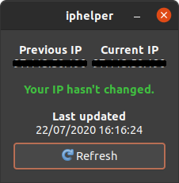

# iphelper
A simple program that lets you know when your public IP address has changed.

**iphelper** shows your public IP address along with the IP address you had last time iphelper was loaded. Keep in mind that iphelper currently **does not automatically refresh,** so you'll have to press "🔄 Refresh" to see if your public IP address has changed. Although simple, iphelper is useful for ensuring your Google Analytics IP filters are up-to-date, whether your VPN has activated properly, and much more!

At the moment iphelper is not packaged, so you'll have to install its prerequisites manually:

- PyGObject 3.36.0

iphelper is verified to work with:

- Ubuntu 20.04 LTS
- Python 3.8.5

After cloning the repository and installing the prerequisites, you can run when iphelper using `python3 /path/to/iphelper/iphelper.py`, or just `python3 iphelper` if you are in the appropriate repository.

## Highlight colors

You can change the highlight colors by modifying `OK`, `WARN`, and `ERROR` in the beginning of `iphelper.py`.

-  `OK = "#40c040"`
-  `WARN = "#ff8040"`
-  `ERROR = "#ff4040"`

## Troubleshooting

### Failed to access https://ident.me

iphelper uses [ident.me](https://ident.me) for finding your public IP address; see [api.ident.me](https://api.ident.me/) for more info. If it is down, you will get this error. In `iphelper.py`, change `IP_SERVER = "https://ident.me"` to another URL that serves your public IP address in plain text.

### No internet.

iphelper uses [google.com](https://google.com) for checking there is internet access if [ident.me](https://ident.me) is down. If you see this error, it means that either you have no internet or [google.com](https://google.com) is down or blocked in your area. In `iphelper.py`, change `INTERNET_SERVER` to literally any URL you know works. Make sure that `IP_SERVER` and `INTERNET_SERVER` are not the same, though.

### Previous IP Not found

The first time iphelper runs, or if `iphelper.log` has been deleted, "Previous IP" will display "Not found". This is not an error; the warning will disappear if you press "🔄 Refresh".

## To-do

- Packaging
- Automatic refresh
- Asynchronous loading
- IPv4/IPv6 support (unfortunately, [v6.ident.me](https://v6.ident.me/) is down)
- Automatically run on boot
- Windows support
- Logo
- Move to new domain: [iphelper.io](https://iphelper.io)
